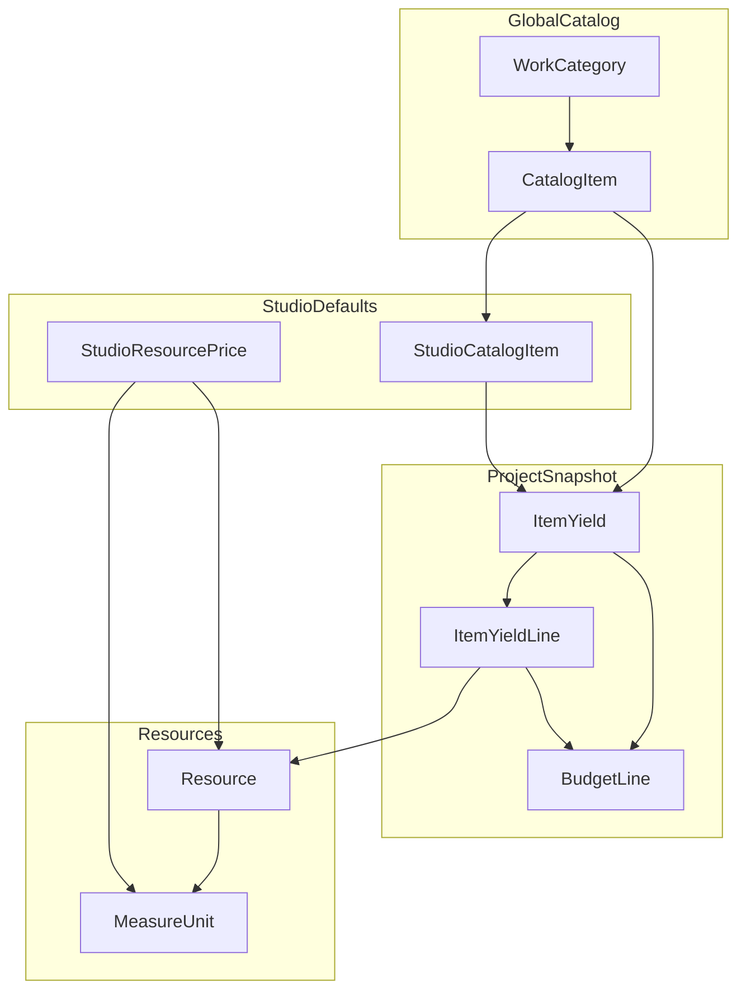

# Catalog, Yields, and Pricing Model

This document is the reference for catalog structure, item yields, and pricing.

It intentionally separates:

- **Current behavior (implemented):** what the app does today.
- **Product vision (not implemented yet):** ideas and roadmap directions.

---

## 1) Current behavior (implemented)

## 1.1 Core domain model

| Concept                     | Prisma model          | Scope   | Purpose                                                             |
| --------------------------- | --------------------- | ------- | ------------------------------------------------------------------- |
| Rubro                       | `WorkCategory`        | Global  | Stable work category catalog shared by all studios.                 |
| Item (catalog)              | `CatalogItem`         | Global  | Standard item definitions under a work category.                    |
| Studio default for item     | `StudioCatalogItem`   | Studio  | Studio-level default yield configuration for a catalog item.        |
| Project item yield snapshot | `ItemYield`           | Project | Frozen per-project copy used by budgeting and costing.              |
| Yield resource line         | `ItemYieldLine`       | Project | Material/labor/equipment line with quantities and purchase mapping. |
| Resource unit price         | `StudioResourcePrice` | Studio  | Price per resource and measure unit over time.                      |

## 1.2 Three layers and what they answer

| Layer                          | Question it answers                               | Notes                                                        |
| ------------------------------ | ------------------------------------------------- | ------------------------------------------------------------ |
| **Catalog (rubros + items)**   | _What tasks exist and how are they grouped?_      | Baseline is global, curated by product/catalog operators.    |
| **Yields (per item)**          | _For one item unit, what resources are consumed?_ | Stored in studio defaults and snapshotted into each project. |
| **Prices (per resource unit)** | _How much does each resource unit cost?_          | Studio-scoped and time-sensitive.                            |

## 1.3 Units and dimensional compatibility

- A yield line is always expressed in the **resource unit context**, not in the budget line unit alone.
- Purchase mapping lines can specify `purchaseMeasureUnitId` and `yieldPerPurchase`.
- For mapped lines, purchase unit compatibility is validated against the resource base measure unit compatibility group.
- Incompatible mappings are rejected with a `400` error.

Practical example:

- If a resource base unit is in the **mass** compatibility group (for example kg), mapping to a **count** purchase unit (for example unit/box without a compatible group) is invalid.

## 1.4 Pricing model

- Prices are modeled at resource level (`StudioResourcePrice`), with:
  - `resourceId`
  - `measureUnitId`
  - `unitPrice`
  - `effectiveAt`
- Item/budget economics are derived from:
  1. Item yield lines (`ItemYieldLine`) and their scaling behavior.
  2. Resource price rows (`StudioResourcePrice`) in matching units.
  3. Budget line rules and overrides.

So prices are **not** a single magic value on the item catalog row; they are computed from yields + resource prices at project/studio context.

## 1.5 Snapshot lifecycle (global -> studio -> project)

1. Product provides global catalog rows (`WorkCategory`, `CatalogItem`, `MeasureUnit`, `Resource`).
2. A studio can customize defaults for catalog items (`StudioCatalogItem` + lines).
3. When a project is bootstrapped, the app creates one `ItemYield` snapshot per active catalog item.
4. Existing project snapshots remain frozen unless explicitly edited in that project.

Drift handling:

- If a studio default changes after project snapshot capture, the app can create an `Assumption` with type `STUDIO_YIELD_STALE`.
- This informs users that the project keeps the older captured version until they decide to update.

## 1.6 Sharing model

- **Global shared:** `WorkCategory`, `CatalogItem`, `MeasureUnit`, `Resource`.
- **Studio private defaults:** `StudioCatalogItem`, `StudioResourcePrice`.
- **Project private snapshot:** `ItemYield` and `ItemYieldLine`.

This is a **shared baseline + private customization + per-project snapshot** model.

## 1.7 Catalog stability and operational safety

Key stability rules:

- Seed upserts for global catalogs are keyed by stable `code`.
- Reordering/deleting/changing meaning of existing seeded rows is risky in deployed environments.
- Treat seeded catalog arrays as append-oriented unless accompanied by explicit data migration.

For production-safe creation of new global rows, prefer:

- `POST /v1/work-categories`
- `POST /v1/measure-units`

These routes are protected by `X-Catalog-Write-Secret` (`CATALOG_WRITE_SECRET`) and are intended for controlled global catalog writes.

## 1.8 Relationship diagram

Reading order:

1. Start from global `CatalogItem`.
2. Apply studio defaults from `StudioCatalogItem` when present.
3. Use project snapshot `ItemYield` + `ItemYieldLine`.
4. Combine with `StudioResourcePrice` to cost budget lines.

---

## 2) Product vision (not implemented yet)

These are valid product directions, but they are not guaranteed current behavior.

### 2.1 Authoring and UX ideas

- AI suggestion of item short name from item scope description.
- Item-first workflow from scope text to suggested unit/yield skeleton.
- Faster project setup via project templates with preselected standard items.

### 2.2 Domain-specific authoring tools

- Specialized calculators for item families (for example concrete dosage, rebar helpers, block/tile systems).
- Guided yield builders for common construction systems in Argentina.

### 2.3 Catalog growth and publication

- Optional publication of selected custom items/yields into a shared public library.
- Governance decisions pending: moderation, attribution, fork vs reference, regional variants, versioning.

---

## 3) One-line summary

**Global catalog defines rubros/items/resources, studios define defaults and prices, projects consume frozen yield snapshots, and budget costs are derived from yields plus resource prices.**
