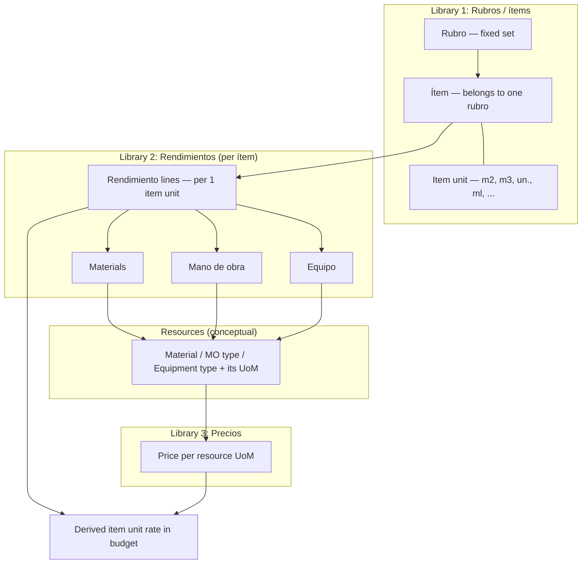

# Catalog, yields, and pricing model

Canonical product definitions for **rubros**, **ítems** (cómputo / tasks), **rendimientos** (materials + labor + equipment per item unit), and **precios** (per resource unit). This document nails the domain; implementation can follow.

---

## 1. Three libraries (three different things). 4: insumos (library of preset materials, labor units and equipment units). on the other hand, i think rendimientos os not a library, but rather a parameter pf each item (not sure)

| Library            | Question it answers                                                                        | Typical content                                                                                                                          |
| ------------------ | ------------------------------------------------------------------------------------------ | ---------------------------------------------------------------------------------------------------------------------------------------- |
| **Rubros / ítems** | _What task is this line of work, and in which unit do we measure it on site?_              | Semi-Fixed **rubros**; **ítems** under each rubro (name, scope, **item unit**). A new item is handled by the product team, not the user. |
| **Rendimientos**   | _Per one unit of that item, how much material, labor (MO), and equipment does it consume?_ | Quantities per **item unit**, each line in the **resource’s own UoM** (kg, bag, h, machine-day, …).                                      |
| **Precios**        | _What does one unit of each resource cost?_                                                | Money per **resource UoM** (e.g. 25 kg cement bag, m³ sand, hourly wage).                                                                |

All three are **seeded by the app** (OOTB) and **highly customizable** by the user/studio.

---

## 2. Rubros and ítems

- **Rubros** are **fixed**. Users do **not** create new rubros. If a task does not clearly fit, park it under something like **“Otros”** (or equivalent). A new rubro is handled by the product team, not the user.
- **Ítems** belong to exactly one rubro. New site reality that is not covered by an existing line → **create a new ítem** under an existing rubro (or under “Otros” if unsure).
- The **ítem library** is the richest OOTB layer: it should cover a **typical** obra; gaps are filled by **new ítems** and by **tweaked rendimientos** (see §5).

**Example rubros (illustrative):**

1. Tareas preliminares
2. Demoliciones
3. Movimiento de suelos
4. Fundaciones
5. …

each item has a longer paragraph describing the scope of the item. This are the legal conditions of the item, for example.: si los Razo de placa de yeso de 9 mm con estructura de perfilería tradicional con uña perimetral incluye armado, emplacado en encintado y tomado de juntas. The Name of The item is a one sentence summary of the longer scope. It would be desirable to have an AI suggestion for the items name given the description introduced by the user or picked from the item Library, and later modified. The list of the items scope description will later for the project briefing but this is also a valuable resource to establish how the item is measured, and the. rendimientos. The library of items included in the presets of the app covers at least 90% of a standard construction project in Argentina. The user starts with a blank project. That is a project that has no items but just have all the rubros. The user than at each item picking it from the library as it is or picking an item that already exist and adjust need or creating an item from scratch it would be disabled that the user starts by writing the items scope description because that helps determining the measurement units the justification, the materials, labor, and equipment it requires.

**Example ítems under “Fundaciones”:**

- 4.1 Zapata corrida de ladrillo común con azotado hidrófugo
- 4.2 Pilotines de hormigón armado
- 4.3 Bases aisladas de hormigón armado
- 4.4 Viga de fundación de hormigón armado

---

## 3. Rendimientos (per ítem)

- A **rendimiento** is **data of the ítem**: for **1 unit** of the ítem (1 m², 1 m³, 1 un., …), specify required **materials**, **mano de obra**, and **equipo**.
- OOTB ítems should ship with a sensible **materials** rendimiento at minimum; users will still override often.
- **Why heavy customization:** (1) not every ítem can be pre-listed; (2) the same ítem can have **very different** yields in real projects.

**Important:** Resource lines use **their own units**, which are **not** the ítem’s **unit of measure on site** (e.g. ítem in m² of slab; cement in bags of 25 kg).

---

## 4. Precios (per resource, not “the ítem’s magic number”)

- Prices apply to **materials, MO, and equipment** in **their purchasing or cost units**.
- Example: a **25 kg bag of cement** has a price; the app **may** suggest it (e.g. from the web) but it is **not critical**—the user can enter it.
- The **unit rate for the ítem** in the budget is **derived**: roughly, sum over rendimiento lines of _(quantity per item unit × price per resource unit)_, plus whatever the product adds (waste, margins, subcontract toggles, etc.).

---

## 5. Workflow: similar ítem vs new ítem

When the catalog line is **not exactly** what the user needs:

1. **Small gap:** Start from a **similar ítem** and **adjust the rendimiento** (e.g. more cement, remove aggregate, swap “piedra partida” for “piedra binder”).
2. **Large gap:** Create a **new ítem** (e.g. “muro ladrillo hueco 12 cm” exists but “18 cm” does not → new ítem under the right rubro).

**Crowdsourced growth (product intent):** a **fully custom ítem** created by a user **should be able to feed** a **general / public task library** so the catalog grows **without central-only effort** (e.g. a large contractor publishes a definition others can reuse). Exact rules (moderation, fork vs reference, region, versioning) are **TBD**.

---

## 6. What is shared across studios?

| Layer                                                 | Typical sharing model                                                                                                                                          |
| ----------------------------------------------------- | -------------------------------------------------------------------------------------------------------------------------------------------------------------- |
| **Rubros + core ítem catalog + default rendimientos** | **Product-wide** (everyone gets the same OOTB baseline; it evolves with releases).                                                                             |
| **Studio (or project) overrides**                     | **Private** to that scope: my yields and my prices for my job, even if the ítem name matches OOTB.                                                             |
| **“General / public library”**                        | **Opt-in or published** contributions (custom ítems + their rendimientos) that enrich the **global** catalog—not “every draft visible to everyone” by default. |

So: **ítems and rendimientos are not “only dosificaciones shared.”** The mental model is: **shared baseline + private customization + optional publication** of ítems (with yields) into a broader library. **Precios** are usually **studio/project** (and time-sensitive); sharing them globally is **not** implied.

---

## 7. Relationship diagram

**Reading order:** pick an **ítem** → its **rendimiento** lists **resources** and quantities per ítem unit → **precios** attach to each resource in **its** unit → the **budget line rate** for the ítem is **derived**.

---

## 8. One-line summary

**Rubro** = fixed shelf. **Ítem** = certifiable task line with an **item unit** (unit of measure on site). **Rendimiento** = M + MO + Eq **per ítem unit**. **Precio** = cost **per resource unit**. **Sharing** = OOTB for all + private overrides + optional feed into a **general ítem library**.

---

## 9. Open product decisions (not blocking this doc)

- Fork vs reference when reusing a published ítem.
- Moderation and attribution for the public/general library.
- Whether rendimiento defaults are **per studio**, **per project**, or both.
- How “Otros” is structured (single rubro vs policy).
